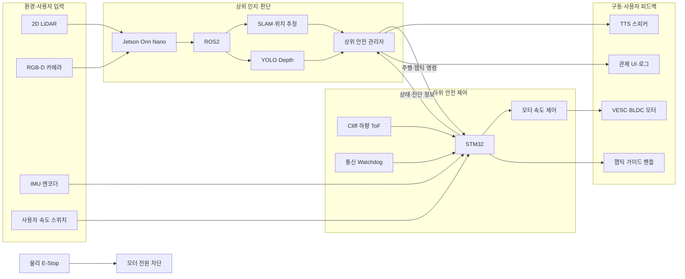

# 위험 감지·촉각 전달 통합형 시각장애인 보행 유도 AMR

> AI·로봇 안전제어 솔루션 챌린지 1기  
> 팀명: 국민로보틱스  
> 개발 기간: 2026.07.20 ~ 2026.08.21

## 1. 프로젝트 소개

본 프로젝트는 시각장애인의 안전한 이동을 지원하기 위한 **위험 감지·촉각 전달 통합형 보행 유도 AMR(Autonomous Mobile Robot)** 개발을 목표로 한다.

기존 흰지팡이는 사용자의 팔 길이 안에 있는 근거리 장애물을 중심으로 감지하기 때문에 원거리 장애물, 계단, 승강장 끝과 같은 급격한 노면 낙차에 선제적으로 대응하기 어렵다. 기존 보행 보조 로봇 역시 실내 평지에서의 장애물 회피와 음성 안내에 집중되어 있어, 소음이 많은 환경이나 즉각적인 반응이 필요한 위험 구간에서는 한계가 있다.

본 프로젝트에서는 LiDAR, RGB-D 카메라, ToF 및 Cliff 센서를 이용해 장애물과 낙차 위험을 인지하고, 그 결과를 햅틱 가이드 핸들과 TTS 음성으로 사용자에게 전달한다.

또한 Jetson 기반 상위 인지 시스템과 STM32 기반 하위 안전 제어 시스템을 분리하여, 상위 소프트웨어나 통신에 이상이 발생하더라도 STM32가 독립적으로 모터를 정지할 수 있는 이중 안전 구조를 구현한다.

---

## 2. 프로젝트 목표

최종 목표는 다음 기능을 갖춘 저속 보행 유도 로봇 프로토타입을 완성하는 것이다.

- 2D LiDAR 기반 장애물 감지 및 SLAM
- RGB-D 카메라와 YOLO 기반 객체 인식
- Depth 정보를 이용한 객체 거리 추정
- 전방 장애물 위험도 및 예상 충돌 시간 판단
- 정상·감속·정지·긴급정지·고장 상태 관리
- STM32 기반 실시간 모터 및 안전 제어
- ToF·Cliff 센서 기반 낙차 위험 감지
- 햅틱 핸들을 이용한 방향 및 위험 정보 전달
- TTS를 이용한 장애물·주행 상태 음성 안내
- 통신 단절 및 제어 오류 시 자동 정지
- 물리적 E-Stop을 이용한 모터 구동 전원 차단
- 로봇 상태 모니터링 및 시험 로그 저장

### 최종 성공 기준

> 실내 또는 통제된 준실내 환경에서 지정 경로를 저속으로 주행하고, 전방 장애물을 감지해 감속·정지하며, 햅틱과 음성으로 상황을 안내하고, 낙차·통신 단절·비상정지 상황에서는 안전하게 멈추는 통합 프로토타입을 완성한다.

---

## 3. 핵심 차별점

### 3.1 촉각·청각 다중 피드백

로봇의 진행 방향과 위험 정보를 햅틱 가이드 핸들과 TTS 음성으로 동시에 전달한다.

- 직진 및 방향 전환: 햅틱 패턴
- 장애물 종류와 거리: TTS
- 감속: 약한 반복 진동과 음성 안내
- 정지 및 위험: 강한 진동과 즉시 음성 안내

### 3.2 이중 안전 제어 구조

Jetson은 LiDAR·카메라 데이터를 이용해 장애물과 경로를 판단하고, STM32는 모터·Cliff·ToF 센서를 실시간으로 관리한다.

Jetson 또는 ROS2가 중단되거나 통신이 끊겨도 STM32가 독립적으로 모터를 정지하도록 설계한다.

### 3.3 낙차 위험 독립 감지

계단이나 승강장 끝과 같은 낙차 위험은 카메라 인식 결과만 의존하지 않는다.

하향 ToF 및 Cliff 센서를 STM32에 직접 연결하여, 상위 소프트웨어의 처리 지연이나 오류와 관계없이 정지할 수 있도록 한다.

### 3.4 Fail-safe 설계

다음 상황에서는 정상 주행을 계속하지 않고 안전 상태로 전환한다.

- Jetson–STM32 통신 단절
- 센서 데이터 타임아웃
- Cliff 또는 ToF 낙차 감지
- E-Stop 작동
- 모터 또는 VESC 오류
- 필수 센서 고장
- 비정상적인 속도 명령
- MCU Watchdog 오류

---

## 4. 전체 시스템 구성



### 제어 권한

```text
Jetson: 이동 방향과 목표 속도를 요청
STM32: 주행이 안전한지 최종 판단
E-Stop: 소프트웨어 상태와 관계없이 모터 전원 차단
```

---

## 5. 안전 상태

시스템은 다음 상태를 사용한다.

| 상태 | 설명 |
|---|---|
| `INIT` | 부팅 및 센서·통신 자체 점검 |
| `READY` | 시스템은 정상이지만 주행하지 않는 상태 |
| `RUN` | 정상 저속 주행 |
| `SLOW` | 위험 가능성으로 인해 제한 속도로 감속 |
| `CONTROLLED_STOP` | 일반 장애물이나 경로 문제로 부드럽게 정지 |
| `EMERGENCY_STOP` | 낙차·통신 단절·E-Stop 등에 의한 긴급정지 |
| `FAULT` | 시스템 신뢰성을 보장할 수 없어 주행을 금지한 상태 |

### 상태 우선순위

```text
FAULT / 물리 E-Stop
    > EMERGENCY_STOP
    > CONTROLLED_STOP
    > SLOW
    > RUN
```

### 자동 재출발 방지

`CONTROLLED_STOP`, `EMERGENCY_STOP`, `FAULT` 상태에서는 위험 조건이 해제되더라도 자동으로 재출발하지 않는다.

다음 조건을 확인한 뒤 사용자의 명시적인 재출발 입력을 받아야 한다.

1. 위험 조건 해제
2. 로봇이 완전히 정지했는지 확인
3. 필수 센서 및 통신 상태 확인
4. 사용자 재출발 입력
5. `READY` 상태 전환
6. 저속 출발

자세한 내용은 `docs/safety-state-table.md`를 참고한다.

---

## 6. 장애물 위험 판단

장애물 위험도는 거리뿐만 아니라 TTC(Time to Collision, 예상 충돌 시간)를 함께 사용한다.

```text
TTC = 장애물까지의 거리 ÷ 장애물과의 접근 속도
```

초기 개발 기준은 다음과 같으며, 최종 수치는 실제 차체의 속도와 제동거리 시험 후 확정한다.

| 조건 | 상태 |
|---|---|
| TTC 4초 이상 | `RUN` |
| TTC 2~4초 | `SLOW` |
| TTC 2초 미만 | `CONTROLLED_STOP` |
| TTC 1초 미만 또는 돌발 장애물 | `EMERGENCY_STOP` 후보 |
| 낙차 위험 감지 | `EMERGENCY_STOP` |

거리 판단과 TTC 판단이 다르면 더 위험한 상태를 선택한다.

YOLO는 장애물의 종류와 TTS 문장을 생성하는 데 사용한다. YOLO가 객체 분류에 실패하더라도 LiDAR 또는 Depth 센서가 물리적인 장애물을 감지하면 감속하거나 정지해야 한다.

---

## 7. 주요 하드웨어

| 구분 | 장치 | 역할 |
|---|---|---|
| 상위 제어기 | Jetson Orin Nano Super | AI 비전, SLAM, 경로 및 위험 판단 |
| 하위 제어기 | STM32 | 실시간 안전 판단, 모터 및 햅틱 제어 |
| 거리 센서 | 2D LiDAR | 장애물 거리, SLAM |
| 비전 센서 | RGB-D 카메라 | 객체 인식, Depth 거리 추정 |
| 낙차 센서 | ToF·Cliff 센서 | 계단 및 승강장 끝 감지 |
| 자세 센서 | IMU | 로봇 자세 및 움직임 측정 |
| 구동기 | BLDC 허브모터 | AMR 이동 |
| 모터 드라이버 | VESC | 모터 속도 및 제동 제어 |
| 사용자 인터페이스 | 햅틱 가이드 핸들 | 방향·감속·정지 촉각 전달 |
| 음성 장치 | 스피커 | TTS 안내 |
| 안전 장치 | 물리 E-Stop | 모터 구동 전원 차단 |

하드웨어 모델과 인터페이스는 부품 확정 후 수정한다.

---

## 8. 소프트웨어 구성

```text
guide-amr/
├── README.md
├── docs/
│   ├── system-architecture.md
│   ├── protocol.md
│   ├── safety-state-table.md
│   └── test-plan.md
├── protocol/
│   ├── protocol_constants.py
│   ├── protocol_constants.h
│   └── test_vectors.json
├── jetson/
│   ├── interfaces/
│   ├── serial_bridge/
│   ├── safety_manager/
│   ├── perception/
│   ├── navigation/
│   └── hri/
├── stm32/
│   ├── Core/
│   └── Drivers/
├── monitoring/
├── config/
├── tests/
└── scripts/
```

### Jetson

주요 기능:

- ROS2 시스템 실행
- LiDAR 및 카메라 데이터 처리
- SLAM 및 위치 추정
- YOLO 객체 인식
- Depth 거리 추정
- 장애물 위험도 및 TTC 계산
- 상위 안전 상태 판단
- STM32 명령 및 상태 통신
- TTS 안내
- 상태 모니터링과 로그 저장

### STM32

주요 기능:

- Jetson 명령 수신 및 검증
- 통신 Watchdog
- 모터 목표속도 제한
- VESC 및 BLDC 모터 제어
- Cliff·ToF 낙차 감지
- 햅틱 출력
- E-Stop 상태 확인
- 안전 상태 및 고장 코드 전송
- 긴급정지 후 자동 재출발 방지

### 관제 프로그램

주요 표시 정보:

- 연결 상태
- 현재 안전 상태
- 좌우 바퀴 속도
- 전방 최소거리
- 인식 객체
- Cliff 위험 여부
- 배터리 상태
- 모터 및 센서 오류
- 최근 정지 원인

관제 프로그램은 모터를 직접 제어하지 않고 상태 확인과 TTS·로그 기능을 담당한다.

---

## 9. Jetson–STM32 통신

초기 버전에서는 USB-UART 통신을 사용하고, 하드웨어 여건에 따라 CAN 통신으로 확장한다.

### 초기 통신 설정

```text
통신 방식: USB-UART
보레이트: 115200 bps
바이트 순서: Little-endian
오류 검출: CRC-16
Heartbeat 주기: 100ms
주행 명령 주기: 20~50ms
상태 전송 주기: 50~100ms
통신 정지 기준: 마지막 유효 명령으로부터 300ms
```

### 주요 메시지

| Message ID | 방향 | 설명 |
|---:|---|---|
| `0x01` | Jetson → STM32 | Heartbeat |
| `0x10` | Jetson → STM32 | 주행 명령 |
| `0x11` | Jetson → STM32 | 햅틱 명령 |
| `0x12` | Jetson → STM32 | 시스템 명령 |
| `0x80` | STM32 → Jetson | 로봇 상태 |
| `0x81` | STM32 → Jetson | 긴급 안전 이벤트 |
| `0x82` | STM32 → Jetson | 진단 정보 |

자세한 통신 규격은 `docs/protocol.md`를 참고한다.

---

## 10. 개발 우선순위

### P0 — 필수 구현

- Jetson–STM32 통신
- STM32 모터 정지 및 속도 제한
- 통신 단절 자동 정지
- Cliff·ToF 낙차 감지
- E-Stop 연동
- 안전 상태 머신
- LiDAR 전방 장애물 감지
- 햅틱 정지·방향 신호
- 상태 및 오류 로그
- 실내 장애물 감속·정지 시연

### P1 — 주요 구현

- 2D LiDAR SLAM
- YOLO 객체 인식
- Depth 기반 장애물 거리 추정
- TTC 기반 위험 판단
- 상황별 TTS
- 사용자 속도 단계 설정
- 기본 관제 화면

### P2 — 후속 고도화

- 실외 비정형 환경 자율주행
- 비전 기반 노면 세그멘테이션
- 슬립 추정 및 트랙션 제어
- VLM 기반 상황 인식
- 신호등 및 도시 인프라 연동
- 자율 도킹
- 상용 수준 관제 UI

---

## 11. 개발 로드맵

### 1주차 — 시스템 골격 및 통신

목표: 실제 차체가 없어도 Jetson과 STM32 프로그램을 개별 시험할 수 있는 상태

- 시스템 아키텍처 확정
- 센서와 제어기 인터페이스 확정
- GitHub 저장소 및 개발 규칙 구성
- Jetson–STM32 통신 규격 작성
- UART 패킷 및 CRC 구현
- ROS2 작업공간 구성
- STM32 기본 제어 주기 구성
- 안전 상태 머신 골격 구현
- 통신 Watchdog 구현
- 햅틱 기본 패턴 구현

완료 기준:

- Jetson에서 정상·감속·정지 명령 전송
- STM32에서 명령 구분 및 상태 응답
- CRC 오류 패킷 거부
- 통신 단절 시 정지 상태 전환
- 가상 Cliff 입력 발생 시 긴급정지

### 2주차 — 센서 및 개별 기능

목표: 센서와 사용자 안내 기능을 독립적으로 검증

- LiDAR 전방 최소거리 계산
- LiDAR 데이터 필터링
- 장애물 접근속도 및 TTC 계산
- RGB-D 카메라 연결
- YOLO 객체 인식
- Depth 거리 추정
- ToF·Cliff 센서 처리
- 햅틱 패턴 연결
- TTS 템플릿 구현
- 센서 상태 감시 구현

완료 기준:

- LiDAR 거리 단계가 안정적으로 구분됨
- YOLO 인식 객체에 Depth 거리가 연결됨
- 위험 단계에 맞는 햅틱과 TTS 출력
- 센서 타임아웃 및 비정상 값 감지

### 3주차 — 실제 차체 통합

목표: 저속 실내 통합 주행

- Jetson·STM32·센서·VESC 실제 연결
- 모터 전진 방향 확인
- 좌우 모터 속도 보정
- 엔코더 및 odometry 연결
- 사용자 속도 스위치 연동
- 장애물 감지부터 모터 정지까지 통합
- Cliff 센서에서 STM32 직접 정지 연결
- 상태 및 오류 로그 통합
- 정지 후 자동 재출발 방지

완료 기준:

1. 평지에서 안전하게 출발하고 정지한다.
2. 장애물 접근 시 감속하거나 정지한다.
3. 낙차 모형 앞에서 Jetson 상태와 관계없이 정지한다.
4. 통신선을 분리하면 자동으로 정지한다.
5. 긴급정지 후 사용자 확인 없이 재출발하지 않는다.

### 4주차 — SLAM 및 시연 코스 안정화

목표: 최종 시연 코스에서 반복 가능한 주행

- 실내 지도 작성
- SLAM 위치 추정
- 지정 waypoint 주행
- 정적 장애물 회피
- 동적 장애물 감속
- 센서 노이즈 필터 보강
- 햅틱 강도 및 TTS 빈도 조정
- 관제 화면 구현
- 정지거리와 제어 지연 측정

완료 기준:

- 지정 코스를 반복 주행
- 장애물·감속·정지 시나리오 동작
- 상태와 정지 원인이 관제 화면 및 로그에 표시
- 같은 상황에서 유사한 정지거리 재현

### 5주차 — 안전 검증 및 결과물 정리

목표: 새로운 기능 추가 없이 안정성과 재현성 확보

- 기능 동결
- 통신 단절 시험
- 센서 분리 및 타임아웃 시험
- Jetson 프로세스 종료 시험
- E-Stop 시험
- Cliff 오검출·미검출 시험
- 모터 오류 및 배터리 경고 시험
- 최종 시나리오 반복시험
- 시연 영상 촬영
- README 및 기술 문서 정리
- 시험 결과표 작성
- 최종 발표 자료 준비

최종 시연 시나리오:

1. 정상 유도 및 사용자 속도 조절
2. 장애물 감지 후 감속·햅틱·TTS 안내
3. 경로가 막힌 경우 안전 정지
4. 계단 또는 낙차 모형 감지 후 긴급정지
5. 통신 단절 또는 E-Stop 작동 후 재출발 방지

---

## 12. 개발 규칙

### 브랜치

```text
main        검증된 안정 버전
develop     다음 통합 버전
feature/*   기능 개발
fix/*       오류 수정
```

예시:

```text
feature/serial-protocol
feature/stm32-safety
feature/lidar-obstacle
feature/yolo-depth
feature/haptic
feature/tts
fix/communication-timeout
```

### 커밋 메시지

```text
feat: 새로운 기능
fix: 오류 수정
test: 테스트 추가 또는 수정
docs: 문서 수정
refactor: 동작 변경 없는 코드 정리
chore: 설정 및 개발 환경 변경
```

예시:

```text
feat: LiDAR 전방 최소거리 계산 추가
feat: STM32 통신 타임아웃 정지 구현
fix: UART CRC 오류 처리 수정
test: Cliff 센서 긴급정지 시험 추가
docs: 안전 상태표 업데이트
```

### Pull Request

다음 항목을 작성한다.

```text
변경 내용
변경 이유
시험 방법
시험 결과
안전 기능에 미치는 영향
```

모터, 통신, 안전 상태와 관련된 변경은 다른 팀원 한 명 이상이 확인한 뒤 병합한다.

---

## 13. 실행 및 개발 환경

### Jetson

```text
Platform: Jetson Orin Nano Super
OS: Ubuntu
Middleware: ROS2
Primary language: Python
AI inference: YOLO
Navigation: SLAM Toolbox / Nav2
```

### STM32

```text
Platform: STM32
Language: C
Development environment: STM32CubeIDE
Motor controller: VESC
```

### Monitoring

```text
Language: C# 또는 Python
Role: 상태 관제, 로그, TTS
```

정확한 버전과 설치 명령은 개발 환경 확정 후 추가한다.

---

## 14. 시험 지표

| 항목 | 초기 목표 |
|---|---:|
| 장애물 감지 성공률 | 95% 이상 |
| 낙차 위험 감지 | 반복시험 중 미검출 0회 목표 |
| 통신 단절 후 정지 명령 | 300ms 이하 |
| 햅틱 반응시간 | 200ms 이하 |
| TTS 안내 지연 | 1초 이하 |
| 정상 구간 오정지율 | 5% 이하 |
| 최종 시나리오 연속 성공 | 10회 이상 |
| 재부팅 후 준비 완료 | 2분 이하 |

안전 성능은 다음 항목을 구분해 측정한다.

- 센서 측정 주기
- 위험 판단 시간
- Jetson–STM32 통신 지연
- STM32 제어 처리 시간
- VESC 제동 명령 발생 시간
- 실제 차체 정지시간
- 실제 차체 정지거리

---

## 15. 안전 주의사항

본 프로젝트는 교육 및 연구 목적의 프로토타입이며, 실제 시각장애인의 독립 보행을 즉시 보장하는 상용 안전 장비가 아니다.

다음 원칙을 준수한다.

- 초기 모터 시험은 바퀴를 지면에서 띄운 상태로 진행한다.
- 이동 시험은 가장 낮은 속도부터 시작한다.
- 계단·승강장 시험은 실제 위험 구간이 아닌 낙차 모형에서 수행한다.
- 테스트 구역에 안전요원을 배치한다.
- 시험 담당자는 언제든 E-Stop을 작동할 수 있어야 한다.
- 실제 사용자를 대상으로 시험하기 전에 충분한 무인·보조 시험을 진행한다.
- 긴급정지 시 로봇뿐 아니라 사용자의 관성과 낙상 가능성을 확인한다.
- 안전 관련 오류를 숨기거나 자동으로 무시하지 않는다.
- `EMERGENCY_STOP`과 `FAULT` 상태에서는 자동 재출발을 금지한다.

---

## 16. 문서

| 문서 | 설명 |
|---|---|
| `docs/system-architecture.md` | 전체 시스템 구조와 데이터 흐름 |
| `docs/protocol.md` | Jetson–STM32 통신 규격 |
| `docs/safety-state-table.md` | 안전 상태와 전환 조건 |
| `docs/test-plan.md` | 단위·통합·안전 시험 계획 |
| `docs/hardware-interface.md` | 센서·제어기·배선 인터페이스 |
| `docs/demo-scenario.md` | 최종 시연 순서와 합격 기준 |

---

## 17. 팀 구성

| 역할 | 담당자 | 주요 업무 |
|---|---|---|
| 프로젝트 총괄 | 박재영 | 프로젝트 조율, 전력·신호 인프라, 모터 구동 |
| 기구 설계·제작 | 백용재 | 차체, 서스펜션, 구동부 설계 및 제작 |
| 기구 설계·제작 | 김태우 | 차체 제작, 예산 및 부품 관리 |
| 기구 설계·제작 | 김경수 | 설계·제작, 일정 및 마일스톤 관리 |
| 통합 소프트웨어 | 배성원 | AI 인지, ROS2, STM32 및 통합 소프트웨어 |

역할과 담당 업무는 프로젝트 진행에 따라 변경될 수 있다.

---

## 18. 향후 발전 방향

- 실외 비정형 환경 주행
- 노면 세그멘테이션 및 위험도 판단
- 사용자 보행 의도 인식
- 신호등 및 스마트시티 인프라 연동
- 자율 충전 및 도킹
- 사용자별 햅틱 강도와 보행속도 설정
- 실제 시각장애인 사용성 평가
- 안전 규격과 인증 요구사항 검토

---

## 19. 현재 개발 상태

- [ ] 시스템 아키텍처 확정
- [ ] 통신 규격 확정
- [ ] 안전 상태표 확정
- [ ] Jetson 개발 환경 구성
- [ ] STM32 개발 환경 구성
- [ ] Jetson–STM32 통신
- [ ] 통신 단절 자동 정지
- [ ] 모터 기본 구동
- [ ] Cliff·ToF 낙차 감지
- [ ] 햅틱 출력
- [ ] LiDAR 장애물 감지
- [ ] YOLO 객체 인식
- [ ] Depth 거리 추정
- [ ] TTS 음성 안내
- [ ] 안전 상태 관리자
- [ ] SLAM 및 위치 추정
- [ ] 관제 프로그램
- [ ] 실내 통합 주행
- [ ] 최종 안전 시험
- [ ] 최종 시연 및 문서화

---

## License

본 저장소의 라이선스와 외부 라이브러리·모델의 사용 조건은 추후 확정한다.

---

## 설치 및 실행

이 프로젝트는 GitHub에서 소스코드를 내려받은 후 Jetson 개발환경을 구성하고, ROS2 작업공간을 빌드하여 실행한다.

전체 과정은 다음과 같다.

```text
GitHub 저장소 Clone
→ Jetson 개발환경 설정
→ 프로젝트 의존성 설치
→ ROS2 작업공간 빌드
→ 하드웨어 연결 상태 확인
→ 시뮬레이션 또는 실제 로봇 실행
```

> `git clone`은 프로젝트 소스코드와 설정 파일을 내려받는 작업이다. Ubuntu, ROS2, JetPack, 센서 드라이버, Python 패키지 및 STM32 펌웨어는 별도로 설치하거나 빌드해야 한다.

---

### 1. 사전 요구사항

#### Jetson

- NVIDIA Jetson Orin Nano Super
- JetPack이 설치된 Ubuntu
- ROS2
- Python 3
- Git
- `colcon`
- LiDAR 및 RGB-D 카메라 드라이버
- USB-UART 또는 CAN 인터페이스

#### STM32

- STM32CubeIDE
- ST-Link
- 프로젝트에서 사용하는 STM32 보드
- VESC 및 BLDC 모터 드라이버
- Cliff·ToF·IMU·햅틱 장치

정확한 운영체제, ROS2 배포판, JetPack 및 Python 버전은 개발환경이 확정된 후 아래에 기록한다.

| 항목 | 버전 |
|---|---|
| Ubuntu | 추후 작성 |
| JetPack | 추후 작성 |
| ROS2 | 추후 작성 |
| Python | 추후 작성 |
| CUDA | 추후 작성 |
| OpenCV | 추후 작성 |
| YOLO | 추후 작성 |
| STM32CubeIDE | 추후 작성 |

---

### 2. GitHub 저장소 내려받기

HTTPS 방식:

```bash
git clone https://github.com/<organization>/<repository>.git
cd <repository>
```

SSH 키가 GitHub에 등록되어 있다면 SSH 방식도 사용할 수 있다.

```bash
git clone git@github.com:<organization>/<repository>.git
cd <repository>
```

예시:

```bash
git clone https://github.com/kookmin-robotics/guide-amr.git
cd guide-amr
```

실제 저장소 주소가 확정되면 위 주소를 수정한다.

---

### 3. 개발 브랜치 선택

검증된 최종 버전은 `main`, 현재 개발 중인 통합 버전은 `develop` 브랜치를 사용한다.

안정 버전 실행:

```bash
git switch main
```

개발 버전 실행:

```bash
git switch develop
```

원격 저장소의 최신 내용을 반영한다.

```bash
git pull origin main
```

또는:

```bash
git pull origin develop
```

실제 로봇 시연에는 기능 개발 브랜치보다 검증된 `main` 브랜치 또는 별도의 릴리스 태그 사용을 권장한다.

---

### 4. 최초 개발환경 설정

저장소를 처음 내려받은 후 다음 스크립트를 실행한다.

```bash
chmod +x scripts/*.sh
./scripts/setup_jetson.sh
```

`setup_jetson.sh`는 다음 작업을 담당한다.

- 필수 프로그램 확인
- Python 가상환경 생성
- Python 패키지 설치
- ROS2 의존성 설치
- 시리얼 통신 권한 확인
- LiDAR·카메라 드라이버 확인
- YOLO 모델 파일 확인
- 필수 설정 파일 생성 안내

환경 설정은 Jetson 한 대당 최초 한 번만 실행하면 된다. 의존성 목록이 변경된 경우 다시 실행할 수 있다.

스크립트가 아직 준비되지 않았다면 수동으로 Python 의존성을 설치한다.

```bash
python3 -m venv .venv
source .venv/bin/activate
python3 -m pip install --upgrade pip
python3 -m pip install -r requirements.txt
```

ROS2 패키지 의존성을 설치한다.

```bash
source /opt/ros/<ROS_DISTRO>/setup.bash

rosdep install \
  --from-paths jetson_ws/src \
  --ignore-src \
  --rosdistro <ROS_DISTRO> \
  -y
```

`<ROS_DISTRO>`는 실제 사용하는 ROS2 배포판 이름으로 변경한다.

---

### 5. 로컬 장치 설정

팀원이나 Jetson마다 시리얼 포트와 카메라 장치 이름이 다를 수 있으므로 개인 장치 설정은 별도 파일로 관리한다.

예시 설정 파일을 복사한다.

```bash
cp config/local.example.yaml config/local.yaml
```

`config/local.yaml`을 현재 장비에 맞게 수정한다.

```yaml
serial:
  port: /dev/ttyUSB0
  baudrate: 115200
  timeout_ms: 300

camera:
  device: /dev/video0

robot:
  hardware_enabled: false
```

`config/local.yaml`은 개인 장치 설정이므로 GitHub에 올리지 않는다.

```gitignore
config/local.yaml
```

시리얼 장치를 확인한다.

```bash
ls /dev/ttyUSB*
ls /dev/ttyACM*
```

현재 사용자가 시리얼 포트에 접근할 수 없는 경우 시스템 설정에 따라 권한을 추가해야 할 수 있다.

---

### 6. YOLO 모델 준비

YOLO 모델은 파일 크기가 클 수 있으므로 일반 Git 저장소에서 제외할 수 있다.

모델 파일은 다음 위치에 배치한다.

```text
models/
└── obstacle_detector.engine
```

또는 개발 단계에서는 다음과 같은 모델을 사용할 수 있다.

```text
models/
├── obstacle_detector.pt
├── obstacle_detector.onnx
└── obstacle_detector.engine
```

모델 파일이 없다면 설치 스크립트 또는 프로젝트에서 지정한 배포 위치를 통해 내려받는다.

```bash
./scripts/download_models.sh
```

모델이 없거나 Jetson과 호환되지 않는 경우 로봇이 주행을 시작하지 않고 오류를 표시해야 한다.

---

### 7. Jetson ROS2 작업공간 빌드

빌드 스크립트를 사용한다.

```bash
./scripts/build_jetson.sh
```

수동으로 빌드할 경우:

```bash
source /opt/ros/<ROS_DISTRO>/setup.bash
cd jetson_ws
colcon build --symlink-install
source install/setup.bash
cd ..
```

빌드가 끝난 후 다음 폴더가 생성된다.

```text
jetson_ws/build/
jetson_ws/install/
jetson_ws/log/
```

위 폴더는 자동 생성 파일이므로 GitHub에 올리지 않는다.

---

### 8. STM32 펌웨어 빌드 및 업로드

Jetson 저장소를 `clone`하더라도 STM32 펌웨어가 MCU에 자동으로 기록되지는 않는다.

STM32CubeIDE를 이용하는 경우:

```text
1. STM32CubeIDE 실행
2. stm32/ 프로젝트 열기
3. 프로젝트 Build
4. ST-Link 연결
5. STM32에 펌웨어 업로드
6. 시리얼 통신 및 센서 상태 확인
```

명령행 빌드·업로드 스크립트가 준비된 경우:

```bash
./scripts/build_firmware.sh
./scripts/flash_firmware.sh
```

펌웨어 업로드는 실제 하드웨어를 변경하므로 자동 실행하지 않는다. 업로드 전 대상 MCU, 보드 연결 및 펌웨어 버전을 확인해야 한다.

Jetson 소프트웨어와 STM32 펌웨어는 동일한 통신 규격 버전을 사용해야 한다.

```text
Jetson protocol version == STM32 protocol version
```

버전이 다르면 모터 주행을 허용하지 않는다.

---

### 9. 시뮬레이션 실행

실제 모터를 연결하기 전에 시뮬레이션 또는 가상 센서 환경에서 먼저 확인한다.

```bash
./scripts/run_simulation.sh
```

또는 ROS2 launch 파일을 직접 실행한다.

```bash
source /opt/ros/<ROS_DISTRO>/setup.bash
source jetson_ws/install/setup.bash

ros2 launch amr_bringup simulation.launch.py
```

시뮬레이션에서 다음 항목을 확인한다.

- `INIT → READY` 상태 전환
- 정상 주행 명령 생성
- 장애물 접근 시 감속
- 정지거리 또는 TTC 기준 충족 시 정지
- 가상 Cliff 입력 시 긴급정지
- 통신 단절 시 긴급정지
- 긴급정지 후 자동 재출발 금지
- 햅틱 명령 및 TTS 이벤트 생성
- 상태와 오류 로그 저장

---

### 10. 하드웨어 연결 상태 확인

실제 로봇 실행 전 하드웨어 점검 스크립트를 실행한다.

```bash
./scripts/check_hardware.sh
```

점검 항목:

- [ ] STM32 통신 연결
- [ ] Jetson–STM32 통신 규격 버전 일치
- [ ] E-Stop 해제 상태
- [ ] Cliff 센서 정상
- [ ] ToF 센서 정상
- [ ] LiDAR 데이터 수신
- [ ] RGB-D 카메라 데이터 수신
- [ ] IMU 및 엔코더 데이터 수신
- [ ] VESC 오류 없음
- [ ] 좌우 모터 목표속도 0
- [ ] 배터리 전압 정상
- [ ] 햅틱 장치 연결
- [ ] TTS 스피커 연결
- [ ] 현재 안전 상태 `READY`
- [ ] 사용자 또는 시험 담당자가 E-Stop에 접근 가능

필수 점검 항목 중 하나라도 실패하면 모터를 활성화하지 않는다.

---

### 11. 실제 로봇 실행

> 실제 로봇은 시뮬레이션 시험과 하드웨어 점검을 통과한 뒤 통제된 환경에서 실행한다.

전체 시스템 실행:

```bash
./scripts/run_robot.sh --mode hardware
```

또는 ROS2 launch 파일을 직접 실행한다.

```bash
source /opt/ros/<ROS_DISTRO>/setup.bash
source jetson_ws/install/setup.bash

ros2 launch amr_bringup robot.launch.py \
  mode:=hardware \
  config_file:=config/local.yaml
```

실행 순서:

```text
1. E-Stop 작동 상태에서 전원 인가
2. Jetson·STM32·센서 부팅
3. 전체 소프트웨어 실행
4. 시스템 자체 점검
5. 모터 목표속도가 0인지 확인
6. E-Stop 해제
7. 시스템 상태 READY 확인
8. 사용자 주행 허가 입력
9. 가장 낮은 속도로 출발
```

실제 하드웨어 실행 모드는 사용자가 명시적으로 `hardware`를 지정해야 한다. 옵션을 생략한 경우 기본 모드는 `simulation` 또는 `motor_disabled`로 설정한다.

---

### 12. 시스템 종료

정상 종료:

```bash
./scripts/stop_robot.sh
```

권장 종료 순서:

```text
1. 목표속도 0 전송
2. 실제 바퀴 속도 0 확인
3. 시스템 상태 READY 또는 CONTROLLED_STOP 확인
4. 모터 출력 비활성화
5. ROS2 노드 종료
6. 센서 및 Jetson 종료
7. 필요 시 E-Stop 작동
8. 메인 전원 차단
```

프로그램 창만 강제 종료해 모터 제어 명령이 불명확하게 남지 않도록 한다. 통신이 단절되면 STM32 Watchdog이 정지 명령을 발생시켜야 한다.

---

### 13. 실행 로그

실행 로그는 다음 위치에 저장한다.

```text
logs/
├── system/
├── safety/
├── communication/
└── rosbag/
```

로그에는 최소한 다음 정보가 포함되어야 한다.

- 실행 시작 시간
- 소프트웨어 및 통신 규격 버전
- 안전 상태 변화
- 상태 변화 원인
- 장애물 거리와 TTC
- Cliff·ToF 감지 결과
- 목표속도와 실제속도
- 통신 오류
- 모터 및 센서 오류
- 긴급정지 원인
- 사용자 리셋 시점

로그와 ROS bag은 용량이 크므로 기본적으로 GitHub에 올리지 않는다.

---

### 14. 최신 코드로 업데이트

원격 저장소의 최신 코드를 받기 전에 현재 브랜치와 수정 상태를 확인한다.

```bash
git status
git branch --show-current
```

최신 코드를 내려받는다.

```bash
git pull origin develop
```

의존성이나 ROS2 패키지가 변경되었다면 다시 설치하고 빌드한다.

```bash
./scripts/setup_jetson.sh
./scripts/build_jetson.sh
```

업데이트 후에는 바로 실제 로봇을 실행하지 않고 먼저 테스트한다.

```bash
./scripts/run_tests.sh
./scripts/run_simulation.sh
./scripts/check_hardware.sh
```

그다음 실제 로봇을 실행한다.

```bash
./scripts/run_robot.sh --mode hardware
```

---

### 15. 권장 전체 실행 순서

#### 최초 설치

```bash
git clone https://github.com/<organization>/<repository>.git
cd <repository>

chmod +x scripts/*.sh
cp config/local.example.yaml config/local.yaml

./scripts/setup_jetson.sh
./scripts/build_jetson.sh
./scripts/run_tests.sh
./scripts/run_simulation.sh
```

#### 이후 일반 실행

```bash
cd <repository>

git pull origin main
./scripts/build_jetson.sh
./scripts/check_hardware.sh
./scripts/run_robot.sh --mode hardware
```

#### 개발 버전 시험

```bash
cd <repository>

git switch develop
git pull origin develop

./scripts/build_jetson.sh
./scripts/run_tests.sh
./scripts/run_simulation.sh
```

---

### 16. 문제 해결

#### 시리얼 포트를 찾을 수 없는 경우

```bash
ls /dev/ttyUSB*
ls /dev/ttyACM*
```

확인 사항:

- USB 케이블 연결
- STM32 전원
- 장치 포트 이름
- 사용자 접근 권한
- 다른 프로그램의 포트 점유 여부

#### ROS2 패키지를 찾을 수 없는 경우

```bash
source /opt/ros/<ROS_DISTRO>/setup.bash
source jetson_ws/install/setup.bash
```

빌드가 완료되지 않았다면:

```bash
./scripts/build_jetson.sh
```

#### Python 패키지를 찾을 수 없는 경우

```bash
source .venv/bin/activate
python3 -m pip install -r requirements.txt
```

#### YOLO 모델을 찾을 수 없는 경우

```bash
ls models/
./scripts/download_models.sh
```

모델 파일 경로가 설정 파일과 일치하는지 확인한다.

#### STM32 통신은 연결됐지만 명령이 적용되지 않는 경우

확인 사항:

- 통신 규격 버전
- 보레이트
- CRC 방식
- Little-endian 설정
- Heartbeat 수신 여부
- `Drive Enable` 상태
- E-Stop 상태
- Cliff 센서 상태
- 현재 `FAULT` 여부
- 재출발 확인 절차

#### 로봇이 `READY`로 전환되지 않는 경우

관제 화면 또는 로그에서 안전 플래그를 확인한다.

```text
ESTOP_ACTIVE
CLIFF_DETECTED
TOF_INVALID
COMM_TIMEOUT
MOTOR_FAULT
ENCODER_FAULT
LOW_BATTERY
SENSOR_TIMEOUT
PROTOCOL_MISMATCH
```

원인을 해결한 뒤 로봇이 완전히 정지한 상태에서 수동 리셋을 수행한다.

---

### 17. 배포 버전 사용

최종 시연이나 안정성 시험에는 개발 중인 최신 커밋보다 검증된 릴리스 태그 사용을 권장한다.

릴리스 목록 확인:

```bash
git tag
```

특정 버전 선택:

```bash
git switch --detach v1.0-final
```

다시 `main` 브랜치로 돌아가기:

```bash
git switch main
```

예정 태그:

```text
v0.1-week1-protocol
v0.2-week2-safety
v0.3-week3-integration
v0.4-week4-demo
v1.0-final
```

각 태그에는 다음 정보를 기록한다.

- 주요 구현 기능
- 필요한 STM32 펌웨어 버전
- 통신 규격 버전
- 테스트 결과
- 알려진 문제
- 실행 가능한 하드웨어 구성

---

### 18. 안전 주의사항

이 프로젝트는 연구·교육 목적의 프로토타입이다. 실제 시각장애인의 독립 보행을 보장하는 인증된 상용 안전 장비가 아니다.

- 실제 로봇 실행 전 반드시 시뮬레이션을 수행한다.
- 최초 모터 시험은 바퀴를 지면에서 띄운 상태로 진행한다.
- 이동 시험은 가장 낮은 속도로 시작한다.
- 실제 계단이나 승강장 끝에서 초기 시험하지 않는다.
- 낙차 시험은 안전하게 제작된 모형에서 수행한다.
- 테스트 구역에 안전요원을 배치한다.
- 시험 담당자는 언제든 E-Stop을 작동할 수 있어야 한다.
- `EMERGENCY_STOP`과 `FAULT` 이후 자동 재출발을 금지한다.
- 실제 하드웨어 모드는 명시적인 사용자 입력 없이 활성화하지 않는다.
- 센서 또는 통신 상태를 신뢰할 수 없으면 주행하지 않는다.
